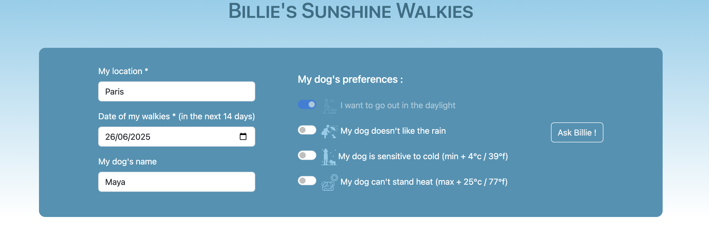
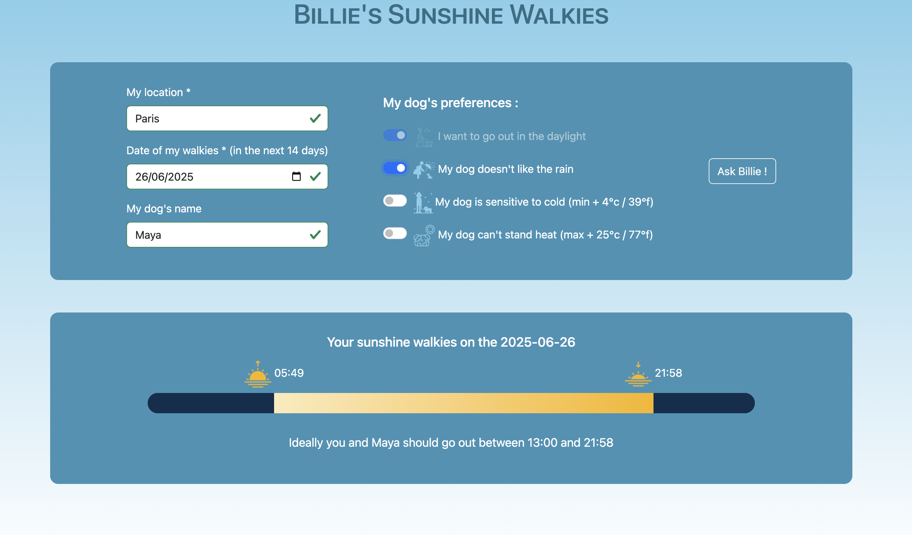
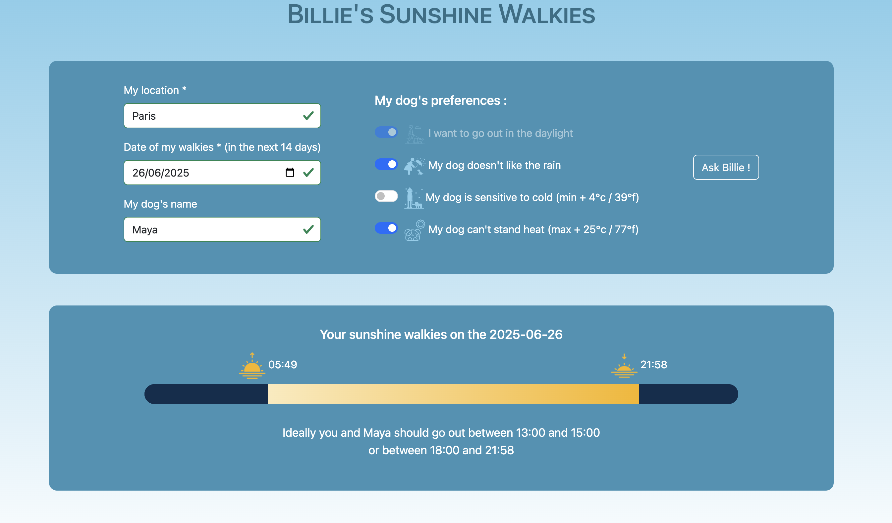

# Sunshines Walkies

This project is an application allowing users to search on a specific day and location when the best conditions for a dog walk are depending on personalized criteria.

## How to start project

At the root of the repository, on the main branch :

- `npm i`to install dependencies
- `npm run dev` to run development server

## Main languages, libraries & frameworks used 

- Git & GitHub
- React
- Bootstrap
- Netlify

## Code editor

Visual Studio Code

## Purpose of the project

The purpose of this project was to practice and solidify my knowledge of React and API calls among other technologies. Having had some difficulties building web apps with API calls I wanted to build a project with a basic weather API to really understand and master the use of APIs. 
I also wanted to build the perfect app that would be useful for me, as a dog owner, as well as for all the dog owners I meet every day who struggle finding the best time to walk their dogs during the day regarding weather conditions specific to dog owners and dogs safety.

## Features done

Search for weather details on a given location and date:
- the user can enter a location using the name of a city anywhere in the world or GPS coordinates
- the date of the search can be any date within the next 14 days on the day of the search
- the user can enter the name of his dog for a personalized experience. "your dog" is the value by default.

- the main criteria for the search are daylight hours. This cannot be changed by the user
- 3 criteria are implemented. THe user can select one or all of them according to his and his dog's needs : 
  * chance of rain <20%
  * temperature > 0°c
  * temperature < 25°c
  The choice of these criteria correspond to realistic dogs safety issues (a temperature too low or too high can be dangerous for the dog's health) or simply to the quality and comfort of the walkies (some dogs and their owners don't enjoy going out when it's raining). 

    
- the search results first display a timeline showing the user the hours of sunrise and sunset so that they can plan their walkies during daylight (useful in winter). 
Then the results display time slots within daylight hours for the given day and location during which they can take the best dog walks according to their criteria. The criteria can be modified after the search and the time slots may change according to the criteria selected.

## Browser support (& tradeoff)

Tested on
- Latest Chrome and Firefox
- Safari 17 (the API request doesn't respond yet because of the date format accepted by Safari which is different than Chrome and Firefox). This needs to be fixed.